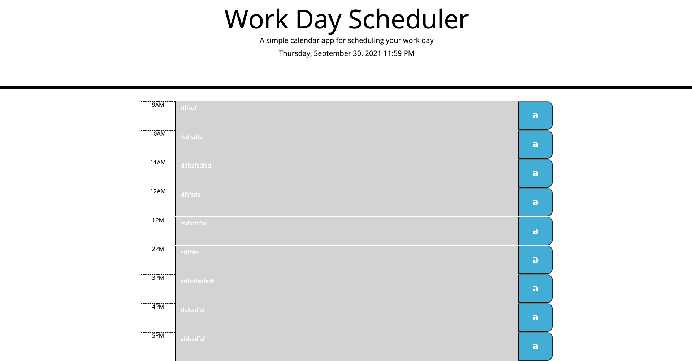

# Homework-datetime
Homework
Created a calender timeline for a to do task list which will shows time past present and future. Tasks written would be saved when page is refreshed. The timeline would be from 9AM-5PM which indicates a typical worktime. 

Screenshot is of the website made 

Link to website ( https://aalimali.github.io/Homework-datetime/)
